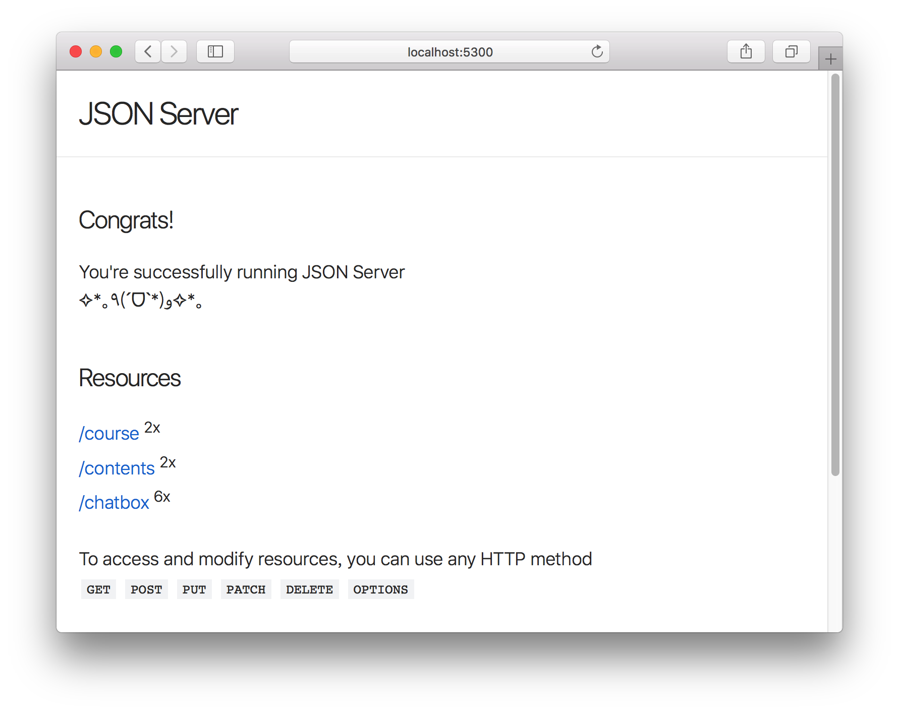
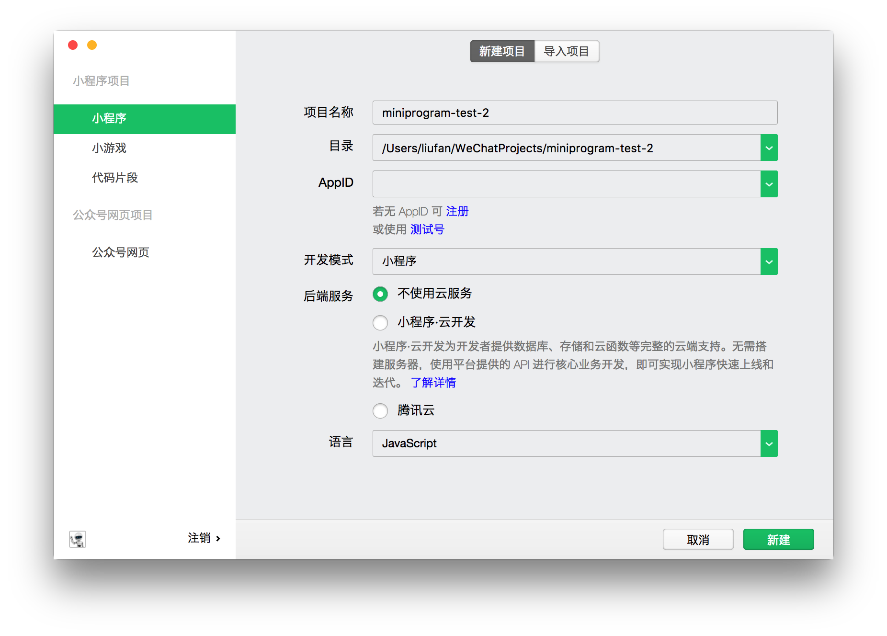
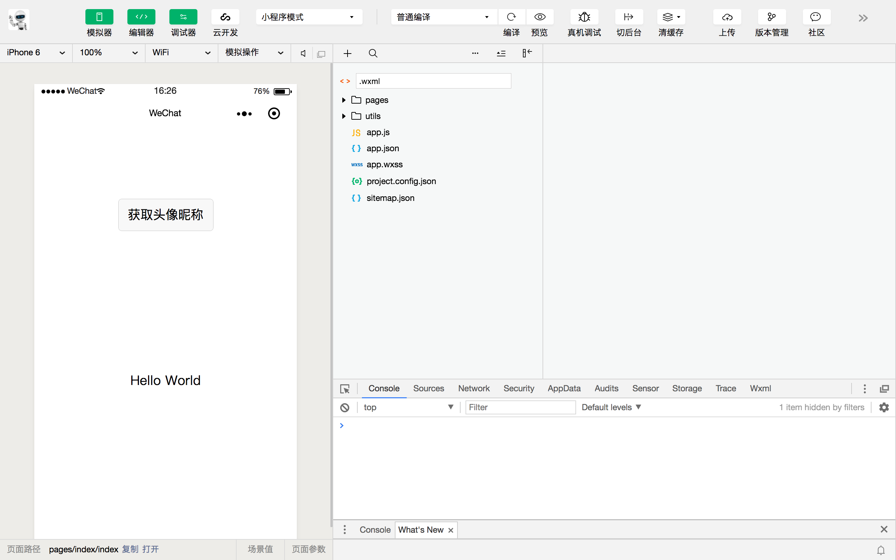
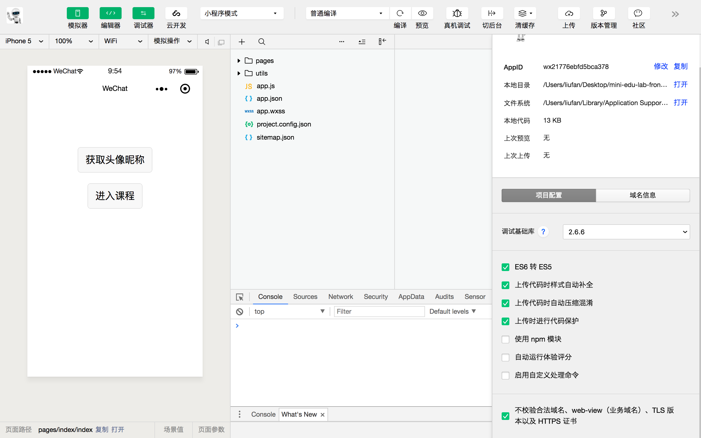
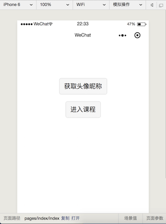
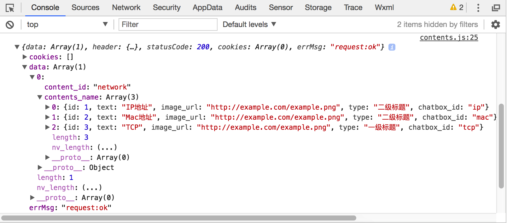
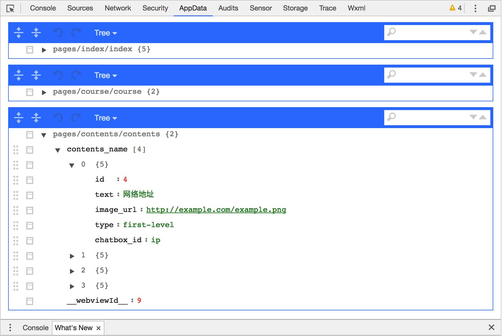

# 高级Web技术 Lab 2：微信小程序

## 1. 实验环境的搭建


### 1.1 微信开发者工具

在微信小程序官方网站上下载自己电脑对应操作系统版本的微信小程序开发者工具，在本地的电脑上安装。

微信小程序的新建项目是需要 Appid 的，需要自己注册一个微信小程序的账号来获得 Appid。

如果自己没有注册过微信小程序的账号，可以用助教账号的```"appid": "wx21776ebfd5bca378"```来完成实验。

关于微信开发者工具的使用，请参考微信小程序官方的文档 [概览](https://developers.weixin.qq.com/miniprogram/dev/devtools/devtools.html)

### 1.2 轻量级后端

最终的 PJ 是前后端分离的项目，小程序作为前端。lab3 是用 SpringBoot 作为Restful后端，这部分还没学习。所以，lab2 用轻量级的服务器，推荐用 json-server ，具体使用参考 Github 主页 : [https://github.com/typicode/json-server](https://github.com/typicode/json-server)

在本地电脑上安装  NodeJS 环境，具体安装过程百度，如果遇到问题无法解决可以联系助教。

```ini
# 在终端通过命令安装json-server包，如果因为权限问题失败了，用sudo npm install -g json-server
npm install -g json-server
# git clone 并进入文件夹
git clone https://github.com/2019-web/mini-edu-lab-server-code.git
cd mini-edu-lab-server-code
# 启动一个以db.josn文件的服务器，端口是5300
json-server --watch --port 5300 db.json
```

在浏览器上可以访问 ```http://localhost:5300``` 看到的界面如下，说明后端搭建成功了。



> 提醒 : ```course```、```contents```和```chatbox```类似于数据库表名，可以点击相应的链接。在 ```db.json```内部存放的是数据库中的数据，最终的PJ数据库结构请自己设计，这里只为了演示方便。
> 这里引入 json-server 的目的，是帮助大家快速搭建起来微信小程序的前后端分离的项目demo，方便调试。微信小程序向后端发起请求，获得请求的数据，然后在微信小程序界面上显示。


## 2. 实验步骤

### 2.1 总体介绍

在微信开发者工具中，新建项目，进入的界面如下:



项目名称、目录、AppID（如果自己没有的话，可以用```wx21776ebfd5bca378```）可以按照自己的实际情况配置。

新建项目完成之后，进入的界面如下:




小程序的目录结构请参考官方的文档，这里不再赘述。[目录结构](https://developers.weixin.qq.com/miniprogram/dev/framework/structure.html)

#### 2.1.1 注意

在网页上的微信小程序的管理后台，```request url``` 是只允许设置域名的，也就是说如果你的小程序要对外发布，后端服务器是必须需要进行域名解析的。

考虑到在本地电脑上的实验阶段，不需要注册域名，在微信开发者工具中的“详细”勾选:

- 不校验合法域名、web-view（业务域名）、TLS 版本以及 HTTPS 证书



这样才可以请求本地的 ```http://localhost:5300``` 域名，否则是请求错误的。


#### 2.1.2 总体介绍

在此基础上，新建course课程目录、contents目录目录、chatbox聊天目录。

在这个三个文件夹内部新建对应名称的Page。

Page页面说明：

- Course课程Page：课程列表

- Contents目录Page：对应课程目录、章节信息、知识点等信息

- Chatbox聊天Page：一个知识点，按照对话式教学的，对话框界面

> 流程说明
> 点击Course课程Page上的若干课程列表，点击其中的一门课程，进入Contents目录Page，显示的是对应的课程的知识点或者章节信息，点击其中的知识点或者章节信息，进入其中的知识点的Chatbox聊天Page。

### 2.2 具体代码说明

#### 2.2.1 index 首页

在```pages/index/index.wxml```中，代码修改如下 :

```html
<!--index.wxml-->
<view class="container">
  <view class="userinfo">
    <button wx:if="{{!hasUserInfo && canIUse}}" open-type="getUserInfo" bindgetuserinfo="getUserInfo"> 获取头像昵称 </button>
    <block wx:else>
      <image bindtap="bindViewTap" class="userinfo-avatar" src="{{userInfo.avatarUrl}}" mode="cover"></image>
      <text class="userinfo-nickname">{{userInfo.nickName}}</text>
    </block>
  </view>
  <view style="margin-top:20px">
    <navigator
    url="../course/course"
    hover-class="navigator-hover"
    >
    <button>进入课程</button>
    </navigator>
  </view>
</view>
```

其它的文件index.json 、index.js、index.wxss保持默认即可。

主要增加的代码如下 :

```
  <view style="margin-top:20px">
    <navigator
    url="../course/course"
    hover-class="navigator-hover"
    >
    <button>进入课程</button>
    </navigator>
  </view>
```

```<navigator></navigator>```可以实现当前小程序内的跳转链接，点击```<button></button>```按钮，可以实现跳转到 Course 文件夹内的Course页面。
微信小程序中，可以用 hover-class 属性来指定元素的点击态效果。

实际的界面如下 :



> 具体内容请参考微信小程序的官方文档。[小程序代码构成](https://developers.weixin.qq.com/miniprogram/dev/quickstart/basic/code.html)

#### 2.2.2 Course课程部分

在```/pages/course/course.wxml```中，代码修改如下 :

```html
<text>pages/course/course.wxml</text>

<view class="container">
  <view class="course">
    <navigator
    url="../contents/contents?content_id=network"
    hover-class="navigator-hover"
    >
    <button>计算机网络</button>
    </navigator>
  </view>
  <view class="course">
    <navigator
    url="../contents/contents?content_id=datastructure"
    hover-class="navigator-hover"
    >
    <button>数据结构</button>
    </navigator>
  </view>
</view>  
```

在```/pages/course/course.wxss```中，代码修改如下:
```
/* pages/course/course.wxss */
.course {
  /* 保持上下两个按钮的间距 */
  margin-top: 20px; 
}
```

在```/pages/course/course.json```中，代码修改如下:

```
{
  "usingComponents": {},
  "navigationBarTitleText": "课程页面"
}
```

```navigationBarTitleText```是进行导航栏标题文字内容的配置，具体参考官方文档。[页面配置](https://developers.weixin.qq.com/miniprogram/dev/reference/configuration/page.html)

在```/pages/course/course.js```中，后面有开发的需要再添加，暂时保持默认。

> lab是为了尽量简单，PJ是要多多注意细节的。

#### 2.2.3 Contents目录部分

在```/pages/contents/content.js```中，代码修改如下 :

```
// pages/course/course.js
Page({

  /**
   * 页面的初始数据
   */
  data: {
    contents_name:[]
  },

  /**
   * 生命周期函数--监听页面加载
   */
  onLoad: function (options) {
    // 从options取得Course页面传过来的URL参数course_id，打印方便调试
    console.log(options.course_id);
    //把this对象复制到临时变量that
    var that = this;
    wx.request({
      url: 'http://localhost:5300/contents?content_id=' + options.content_id,
      headers: {
        'Content-Type': 'application/json'
      },
      success: function (res) {
        console.log(res);
        console.log(res.data[0].contents_name);
        that.setData({
          contents_name: res.data[0].contents_name
        })
      }
    })
  },

  /**
   * 生命周期函数--监听页面初次渲染完成
   */
  onReady: function () {

  },

  /**
   * 生命周期函数--监听页面显示
   */
  onShow: function () {

  },

  /**
   * 生命周期函数--监听页面隐藏
   */
  onHide: function () {

  },

  /**
   * 生命周期函数--监听页面卸载
   */
  onUnload: function () {

  },

  /**
   * 页面相关事件处理函数--监听用户下拉动作
   */
  onPullDownRefresh: function () {

  },

  /**
   * 页面上拉触底事件的处理函数
   */
  onReachBottom: function () {

  },

  /**
   * 用户点击右上角分享
   */
  onShareAppMessage: function () {

  }
})
```

注意这里的

```javascript
    wx.request({
      url: 'http://localhost:5300/contents?content_id=' + options.content_id,
      headers: {
        'Content-Type': 'application/json'
      },
      success: function (res) {
        // 对于url的HTTP GET请求返回的res JSON类型的数据打印，在微信开发者工具的Console终端可以查看输出信息
        console.log(res);
        // 从res数据中获得需要的课程名称数据
        that.setData({
          contents_name: res.data[0].contents_name
        })
      }
    })
```

按照```url```发起HTTP请求后端服务器，返回得到的数据```res```，在浏览器中的控制台的显示如下，关于调试部分，参见小程序官方文档[console](https://developers.weixin.qq.com/miniprogram/dev/reference/api/console.html):




注意这里的

```
that.setData({
  contents_name: res.data[0].contents_name
})
```


setData 函数用于将数据从逻辑层发送到视图层，同时改变对应的 this.data 的值。

想要的这部分数据```res.data[0].contents_name```然后通过 ```setData``` 方法复制给 ```contents_name``` 变量，这个变量在 Page 的 Data 内部定义的。


在```/pages/content/content.wxml```中，代码修改如下：

```
<!--pages/contents/contents.wxml-->
<text>pages/contents/contents.wxml</text>
<view class="container">
  <view class="contents">
    <view wx:for="{{contents_name}}">
    {{item.id}}-{{item.text}}-{{item.image_url}}-{{item.chatbox_id}}
    
    <view class="chatbox">
        <navigator
        url="../chatbox/chatbox?chatbox_id={{item.chatbox_id}}"
        hover-class="navigator-hover"
        >
        <button>{{item.text}}</button>
        </navigator>
    </view>
    </view>
  </view>
</view>  
```

说明 : WXML 中的动态数据均来自对应 Page 的 data。在组件上使用 ```wx:for``` 控制属性绑定一个数组，即可使用数组中各项的数据重复渲染该组件。将```contents_name```数组中按照打印出来，item即为```contents_name```的别名。

同时，在微信开发者工具中，在调试工具中有“AppData”，去查看具体的变量数据:



在```/pages/content/content.js```中，与data内定义的变量是一一对应关系。微信小程序开发的类似于 MVVM 框架，只要修改 Page 的 data 内部定义的变量```contents_name```，```/pages/content/content.wxml```中```{{contents_name}}```的变量就能保持同步的更新。

```
Page({

  /**
   * 页面的初始数据
   */
  data: {
    contents_name:[]
  },
```

> 这部分是小程序开发的重点部分，具体参考微信小程序官方的文档，[数据绑定](https://developers.weixin.qq.com/miniprogram/dev/framework/view/wxml/data.html)、[Page(Object object)](https://developers.weixin.qq.com/miniprogram/dev/reference/api/Page.html)。

#### 2.2.4 chatbox聊天部分

这个里面比较关键的就是 点击底部的“添加信息”按钮，然乎对话信息一条一条的显示出来，考虑到信息的增加界面自动滚动到底部。

在```pages/chatbox/chatbox.wxml```中，修改代码如下 :

```
<!--pages/chatbox/chatbox.wxml-->
<text>pages/chatbox/chatbox.wxml</text>
<!-- padding-bottom:80px;限制文本内容区域距离底端大小，微信小程序中使用padding-bottom解决position:fixed遮挡正文内容的问题 -->
<view id="container" style="padding-bottom:80px;">
<view>
    <view wx:for="{{message}}" class='messageHeight'>
    {{item.uuid}}-{{item.text}}-{{item.image_url}}-{{item.type}}
    </view>
  </view>
</view>  
<view class="bottom" style="width:100%;height:80px;border-top:1px solid red;background-color:#f0f0f0;position:fixed; bottom:0;">
  <button bindtap="addMessage" disable="true">增加信息</button>
</view>
```

在 ```pages/chatbox/chatbox.js```中， 修改代码如下 :

```
// pages/chatbox/chatbox.js
Page({

  /**
   * 页面的初始数据
   */
  data: {
    message:[],      // message数组默认为空
    index: 0,        // 下标默认值为 0
    totalMessage:[]  //将一个知识点所有的message数据都存放到这个数组里
  },

  /**
   * 生命周期函数--监听页面加载
   */
  onLoad: function (options) {
    console.log(options.chatbox_id);
    var that = this;

    wx.request({
      url: 'http://localhost:5300/chatbox?chatbox_id=' + options.chatbox_id,
      headers: {
        'Content-Type': 'application/json'
      },
      success: function (res) {
        console.log(res);
        that.setData({
          totalMessage : res.data[0].message
        })
      }
    })    
  },

  /**
   * 生命周期函数--监听页面初次渲染完成
   */
  onReady: function () {

  },

  /**
   * 生命周期函数--监听页面显示
   */
  onShow: function () {
  },

  /**
   * 生命周期函数--监听页面隐藏
   */
  onHide: function () {

  },

  /**
   * 生命周期函数--监听页面卸载
   */
  onUnload: function () {

  },

  /**
   * 页面相关事件处理函数--监听用户下拉动作
   */
  onPullDownRefresh: function () {

  },

  /**
   * 页面上拉触底事件的处理函数
   */
  onReachBottom: function () {

  },

  /**
   * 用户点击右上角分享
   */
  onShareAppMessage: function () {

  },

  addMessage:function () {
    var that = this;
    // 将 Page 内部定义的 Data 中的 index 赋值给 i
    var i = this.data.index ;
    console.log(this.data.totalMessage.length);

    if(i>=this.data.totalMessage.length){
      // 跳出程序，这种实现比较简陋
      return;
    }

    console.log(this.data.totalMessage[i]);
    // 通过下标的移动，给message数组不断连接(concat)值的方式增加值
    var message = this.data.message.concat(this.data.totalMessage[i]);
    
    // 将函数内部的message变量通过setData赋值给Page中的Data内的变量message，页面的数据随之更新
    that.setData({  
      message: message
    })

    i++;
    // 将函数内部的i变量通过setData赋值给Page中的Data内的变量index，目的是保存下标的值
    that.setData({
      index: i
    })    
    // 创建节点查询器 query
    var query = wx.createSelectorQuery()
    // 选择类名称为 messageHeight 的节点，获取节点位置信息的查询请求
    query.select('.messageHeight').boundingClientRect()

    query.exec(function (res) {
      //  res.id       节点的ID
      //  res.dataset  节点的dataset
      //  res.left     节点的左边界坐标
      //  res.right    节点的右边界坐标
      //  res.top      节点的上边界坐标
      //  res.bottom   节点的下边界坐标
      //  res.width    节点的宽度
      //  res.height   节点的高度 
      console.dir(res[0].height);
      console.dir(res[0].bottom);
      // 滑动页面请求
      wx.pageScrollTo({
      // scrollTop	Number	是	滚动到页面的目标位置（单位px）
      scrollTop: res[0].bottom+res[0].height,
      // duration: 300
    })
   })  

  }
})
```

最终界面的演示效果


#### 2.2.5  终端距离问题的解释
[TODO]

#### 2.2.6  对于 wx.request 的封装
[TODO]

在这个项目中，多处地方都用到了wx.request，这里考虑简单地封装起来，wx.request的简单封装


## 3. 课后作业

截止时间：2018-5-12 23:59:59

提交方式：将文档和压缩包提交到超星指定的lab作业栏里

**题目1:**

- 任务1 : 点击“课程”按钮，进入课程的列表，这里的课程列表数据是以文本的形式写在```course.wxml```中，修改这里的部分，从后台取得数据在前台上显示。

- 任务2 : 在这个项目中，多处地方都用到了wx.request，这里考虑简单地封装起来，wx.request的简单封装，完成这个封装的代码。

最后的代码以“姓名+学号+miniprogram.zip”的文件压缩包压缩。

**题目2:**

在最终的 PJ 中，MyBaitis 或者 Hibernate 都可以称之为 ORM 框架， Spring MVC 可以实现 MVC 框架，Angular 、Vue 是 MVVM 框架，前后端分离的 Restful API 是简单的微服务架构。请试着解释 ORM、MVC、MVVM、微服务架构 之间的概念，并分析一些优缺点。

**题目3:**

同学们在 Web 应用基础课上学习的 jQuery 在 2012 年左右还是相当前沿的 JavaScript 库；而如今，jQuery 慢慢淡出舞台，Angular, React 和 Vue 是三个最流行的前端框架。传统的 JavaScript 库以 DOM 操作为核心，现在流行的 MVVM 前端框架以少操作 DOM 和以数据核心操作对象。谈谈前端这种编程方式衍变的好处来加深对于 MVVM 框架的理解？


